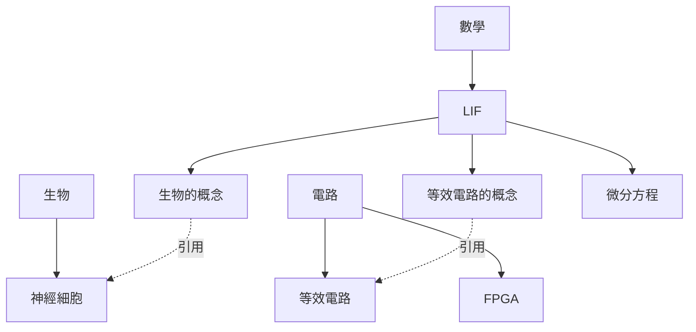

# 教學網站內容架構規劃：鏡頭優先 (Lens-First)

## 背景

`dev/TODO.md` Phase 8 原本規劃的是「主題優先」結構：每個主題（如 LIF）自己開一個資料夾，底下放生物／電路／數學三篇子頁（`docs/lif-neuron/{biological,circuit,math}.md`，已建立骨架）。

後續發現「電路」這個鏡頭不只會講 LIF 的等效電路，還會講 FPGA 硬體實作，於是改朝「鏡頭優先」調整。定案的分工方式如下：

- **生物、電路、數學是三個平行的頂層分類**，不是誰包含誰。`生物` 底下放通用的「神經細胞」概念頁；`電路` 底下放「等效電路」與「FPGA」兩篇通用概念頁；`數學` 底下是各主題（目前只有 LIF）的推導內容。
- **LIF 掛在「數學」底下，自己開一個資料夾**，內有三篇子頁：「生物的概念」「等效電路的概念」「微分方程」。前兩篇是站在 LIF 角度做的簡短收斂，用虛線引用連回 `生物/神經細胞`、`電路/等效電路` 兩篇通用頁；「微分方程」是 LIF 獨有的核心推導，沒有外部引用。
- FPGA 目前沒有任何主題連回它，先當通用概念頁佔位。

**已依此規劃實作**：`docs/biological/`、`docs/circuit/`、`docs/math/lif/` 資料夾骨架、`docs/.vitepress/config.ts` 的 `nav`/`sidebar`、`dev/TODO.md` Phase 8 皆已更新，舊的 `docs/lif-neuron/` 已刪除。以下規劃內容維持存檔備查，各頁實際內容仍是「待撰寫」骨架。

## 樹狀規劃



（實線 = 資料夾從屬關係；虛線 = 頁面內文的交叉引用連結。生物／電路／數學三者是平行關係。）

對應到 `docs/` 資料夾規劃：

```
docs/
├─ biological/
│   └─ neuron-cell.md        <- 生物：神經細胞（通用概念頁）
├─ circuit/
│   ├─ equivalent-circuit.md <- 電路：等效電路（通用概念頁）
│   └─ fpga.md                <- 電路：FPGA（通用概念頁，目前無主題引用）
└─ math/
    └─ lif/
        ├─ biological-concept.md  <- LIF：生物的概念（引用 ../../biological/neuron-cell.md）
        ├─ circuit-concept.md     <- LIF：等效電路的概念（引用 ../../circuit/equivalent-circuit.md）
        └─ differential-equation.md <- LIF：微分方程（核心推導，無外部引用）
```

## 尚待決定的問題

1. **未來新主題（ALIF、COBA、STDP...）比照 LIF 模式**：每個都在 `math/` 底下開自己的資料夾，內含「生物的概念」「等效電路的概念」等收斂頁 + 自己的推導頁，並連回同一批 `biological/`、`circuit/` 通用頁。天生沒有電路對應的主題（例如 Poisson Source 這種純數學工具）可以只有推導頁，不用勉強生「等效電路的概念」。這個推論尚未被使用者明確確認，等真的要新增第二個主題時再驗證是否成立。
2. **FPGA 的範圍與時程**：目前只是佔位，還沒有具體要寫哪些內容、也不確定何時會有主題連回它。

## 下一步

- 撰寫各頁實際內容（目前仍是「待撰寫」骨架），依 `dev/TODO.md` Phase 8 任務清單進行。
- 內容都上線後，清掉 `docs/example/`、`docs/playground/` 架構驗證用假頁面。