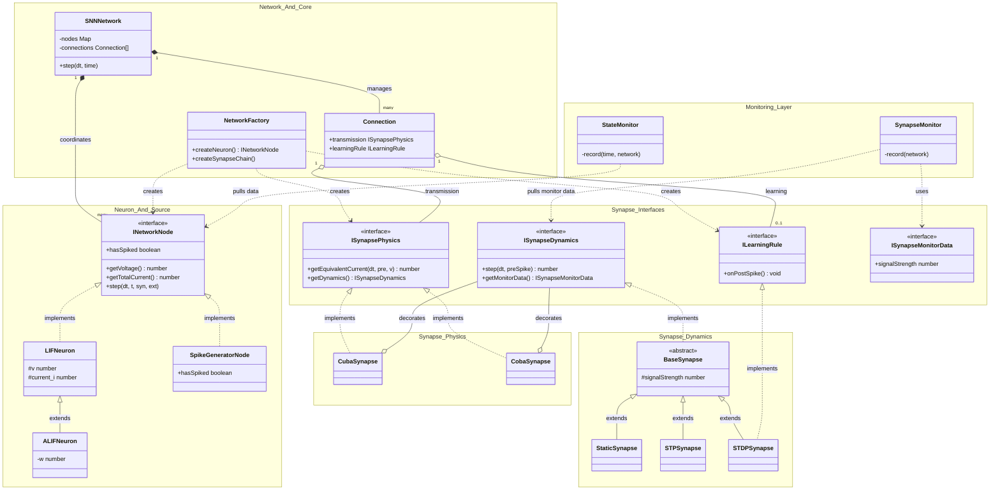

# SNN Sandbox 系統架構圖 (System Structure)

本文件詳述了 SNN 視覺化沙盒的「解耦式」軟體架構、模組職責以及資料流向。

---

## 1. 模組職責說明 (Module Responsibilities)

系統採用高度解耦的層級式架構，將「計算」、「物理」、「學習」與「紀錄」徹底分離。

### I. UI & Orchestration Layer (介面與協調層)
*   **`BasicLIFSandbox.vue`**: 系統中樞。負責管理 Vue 響應式狀態、建立 `SNNNetwork` 拓撲，並觸發模擬與繪圖。

### II. Network & Monitoring Layer (網路、核心與監控)
*   **`network/NetworkFactory.ts`**: 工廠類別。集中實作神經網路拓撲的組裝邏輯，實踐 DRY 原則，降低 UI 層的耦合度。
*   **`core/SNNNetwork.ts`**: 全局協調者。執行「正向路由（物理）」與「反向路由（學習）」雙階段演算法，並廣播模擬事件。
*   **`core/Connection.ts`**: **職責平行化**。持有獨立的 `transmission` (物理) 與 `learningRule` (學習) 通道。
*   **`monitors/`**: 包含 `StateMonitor` 與 `SynapseMonitor`。掛載於網路 Hook，實現資料非侵入式採集。

### III. Neuron & Source Layer (節點與訊號源)
*   **`LIFNeuron.ts` / `ALIFNeuron.ts`**: 實作 $dV/dt$ 積分與發火邏輯，具備「自我感知」電流的能力。
*   **`sources/`**: 包含 `SpikeGeneratorNode` 輕量級脈衝產生器，以及 `PoissonSource` / `GWNSource` 等訊號源工具。

### IV. Synapse Module (突觸三權分立)
*   **`interfaces/`**: 定義 `ISynapseDynamics` (動態), `ISynapsePhysics` (物理), `ILearningRule` (學習) 三大核心原子介面，以及用於狀態快照的 `ISynapseMonitorData` 介面。
*   **`dynamics/`**: 計算訊號強度 $S(t)$（如 Static, STP, STDP）。
*   **`physics/`**: 物理裝飾器。將 $S(t)$ 轉為 $I_{syn}$（如 Cuba, Coba）。**物理層完全不感知學習層的存在。**

---

## 2. Mermaid 類別關聯圖 (Class Diagram)

---

## 3. 模擬資料流向圖 (Simulation Sequence Diagram)

此圖展示了在「介面隔離」重構後，系統如何實現物理傳遞與學習更新的平行運作。

```mermaid
sequenceDiagram
    autonumber
    participant UI as Vue UI (Sandbox)
    participant Net as SNNNetwork
    participant SynPhys as Synapse Physics
    participant SynDyn as Synapse Dynamics
    participant Node as Neuron Node
    participant Learn as Learning Rule (STDP)

    UI->>Net: step(dt, time)
    
    rect rgb(30, 30, 40)
    Note over Net, SynDyn: 1. 正向路由 (Forward: Signal Transmission)
    Net->>SynPhys: getEquivalentCurrent(preSpike, v)
    SynPhys->>SynDyn: step(dt, preSpike)
    SynDyn-->>SynPhys: 回傳 S(t)
    SynPhys-->>Net: 回傳 I_syn (物理轉換後)
    end

    rect rgb(40, 40, 30)
    Note over Net, Node: 2. 狀態積分 (Integration)
    Net->>Node: step(total_i)
    Node->>Node: 求解微分方程，更新 v 與 hasSpiked
    end

    rect rgb(40, 30, 40)
    Note over Net, Learn: 3. 反向學習 (Backward: Plasticity)
    opt 若 Target Node 本回合發火
        Net->>Learn: onPostSpike()
        Learn->>Learn: 執行 LTP 更新權重 w
    end
    end

    rect rgb(30, 40, 30)
    Note over Net, UI: 4. 監聽廣播 (Monitoring)
    Net->>UI: 廣播 postStep 事件 -> Monitor 採集資料渲染
    Note over Net, UI: Monitor 透過 getMonitorData() 取值，不破壞封裝
    end
```

