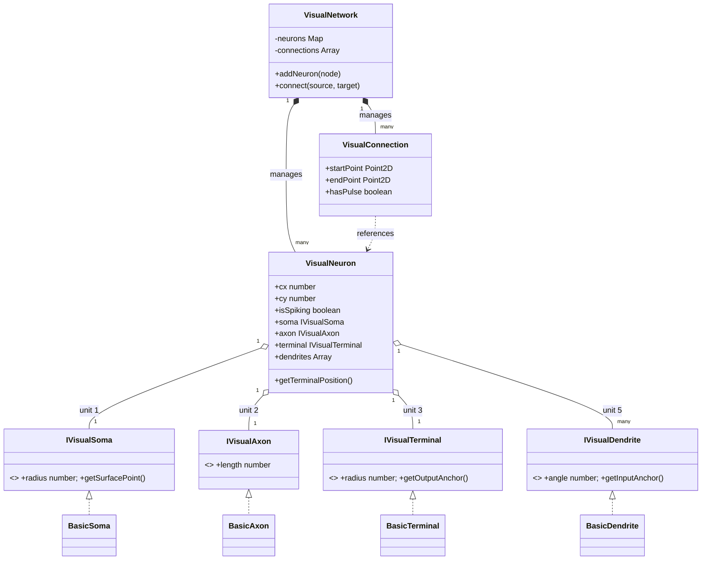
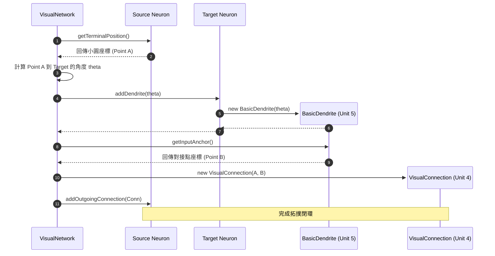

# 神經細胞視覺化系統架構 (Neuron Visualization Architecture)

本文件詳述了 SNN 視覺化系統的「組合式」軟體架構、模組職責以及拓撲連線邏輯。

---

## 1. 模組職責說明 (Module Responsibilities)

系統採用高度解耦的三層架構，將「宏觀佈局」、「節點聚合」與「原子零件」徹底分離。

### I. Layout & Orchestration Layer (佈局與協調層)
*   **`VisualNetwork.ts`**: 全局協調者。管理所有的視覺節點與連線實體，負責同步底層 SNN 引擎狀態（全面使用 `getAdaptationCurrent()` 與 `getMonitorData()` 等正式介面，徹底消除 `instanceof` 與 `as any` 穿越）。
*   **`FeedforwardLayout.ts`**: 佈局策略器。負責根據神經元數量計算絕對座標，執行靜態或動態排版。

### II. Neuron Aggregate Layer (節點聚合層)
*   **`VisualNeuron.ts`**: 節點實體。作為 5 單位要素的聚合根 (Aggregate Root)，協調內部零件的相對位置與狀態更新。
*   **`VisualConnection.ts`**: 連線實體 (單位 4)。負責跨節點的訊號路徑計算，連接起點與終點的 Port。

### III. Atomic Parts Layer (原子零件層)
*   **`interfaces.ts`**: 定義 `IVisualSoma`, `IVisualAxon` 等標準介面，確保視覺形狀可無痛抽換。
*   **`BasicSoma` / `BasicAxon` / `BasicTerminal`**: 單位 1, 2, 3 的基礎幾何實作。
*   **`BasicDendrite`**: 單位 5 (綠線) 的實作，負責計算動態對接點。

### IV. Utility Layer (工具層)
*   **`utils/chartUtils.ts`**: 純函數數學庫。專門負責複雜的 SVG Math 邏輯與路徑 (`d="M..."`) 生成，避免 UI 組件成為 God Component。

---

## 2. Mermaid 類別關聯圖 (Class Diagram)

---

## 3. 拓撲對接流向圖 (Docking Sequence Diagram)

此圖展示了在建立連線時，各組件如何協作完成「黑線 (單位 4) 接綠線 (單位 5)」的對接。

---

## 4. 渲染週期說明 (Rendering Cycle)

1.  **狀態抄寫**: `VisualNetwork` 透過統一介面從 `SNNNetwork` 讀取節點狀態 (`hasSpiked`, `getAdaptationCurrent()`) 與突觸狀態 (`getMonitorData()`)。
2.  **屬性擴散**: 狀態更新至 `VisualNeuron.isSpiking`。
3.  **幾何計算**: Vue 組件調用 `chartUtils.ts` 封裝的方法，將相對位移轉為 SVG 絕對座標。
4.  **DOM 渲染**: SVG 根據計算結果更新 `line`, `circle` 元素顏色與位置。
