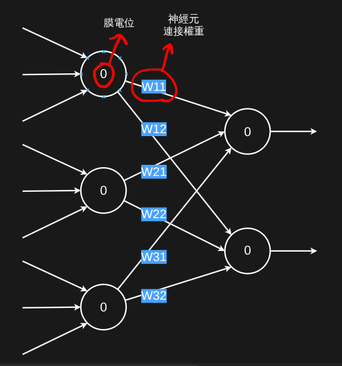

# 神經元連接

接續上一節的 LIF，是描述單一顆神經元的邏輯
 但是神經元要 `連接` 才有意義

$$\frac{dV_m(t)}{dt} = -\frac{1}{\tau_m}(V_m(t) - E_L) + \frac{\color{red} I(t)}{C_m}$$
$$V_m(t_k) \ge V_{th} \to \text{spiking}$$
$$V_m(t) = V_{reset}，\{t_k^+ < t < t_k^+ + \tau_{ref}\}$$

注意這裡的 $\color{red} I(t)$，他會是神經元連接的重點

為了讓推導方便，這裡會重新假設一些數值，方便計算與觀察行為：

<!-- TODO: 數值待確認，先放預設值 -->
| 符號 | 之前的真實數值 | 簡化後的數值 |
|---|---|---|
| $V_{th}$ | $\approx -55\ mV$ | $1$ |
| $E_L$ | $\approx -70\ mV$ | $0$ |
| $V_{reset}$ | $\approx -70\ mV$ | $0$ |
| $C_m$ | 單位 $\mu F/cm^2$，依模型而定 | $1$ |
| $\tau_m$ | $= R_L C_m$，依模型而定 | $10\ ms$ |
| $\tau_{ref}$ | 依模型而定 | $0$ (沒有不應期) |

## 權重以及電流的關係

接下來說明怎麼運作
閾值 $V_{th}$

1. 一開始所有神經元的膜電位 $V_m = 0$

2. 假設前級某一顆神經元吃到輸入而提高電位

