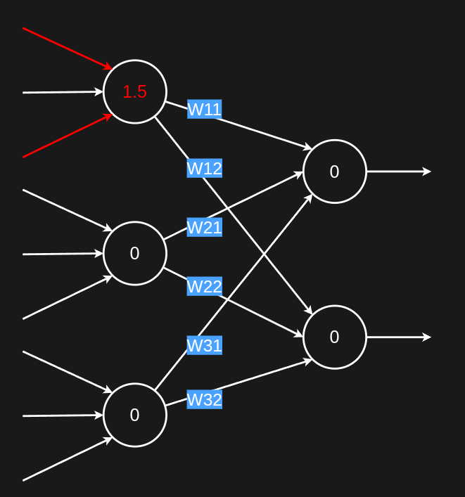
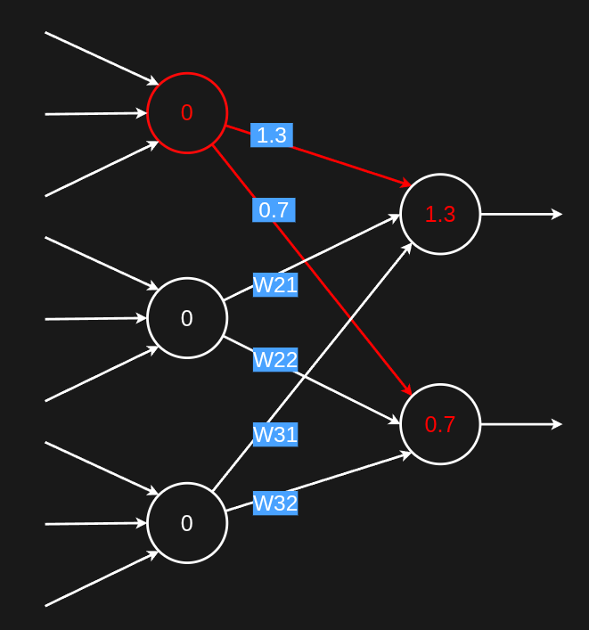
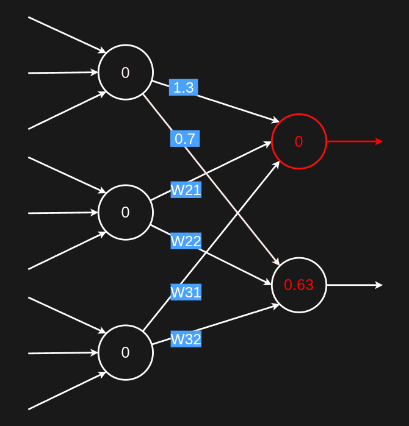

# 神經元連接

接續上一節的 LIF，是描述單一顆神經元的邏輯

$$V_m(t + \Delta t) = V_m(t) + \Delta t \left[ -\frac{1}{\tau_m}(V_m(t) - E_L) + \frac{\color{red}I(t)}{C_m} \right]$$
$$V_m[t_k] \ge V_{th} \to \text{spiking}$$
$$V_m[t_k] = V_{reset}，\{t_k^+ < t < t_k^+ + \tau_{ref}\}$$

注意這裡的 $\color{red} I(t)$，他會是神經元連接的重點

## 簡化符號數值

為了讓推導方便，這裡會重新假設一些數值，方便計算與觀察行為：

| 符號 | 之前的真實數值 | 簡化後的數值 |
|---|---|---|
| $V_{th}$ | $\approx -55\ mV$ | $1$ |
| $E_L$ | $\approx -70\ mV$ | $0$ |
| $V_{reset}$ | $\approx -70\ mV$ | $0$ |
| $C_m$ | 單位 $\mu F/cm^2$，依模型而定 | $1$ |
| $\tau_m$ | $= R_L C_m$，依模型而定 | $10\ ms$ |
| $\tau_{ref}$ | 依模型而定 | $0$ (沒有不應期) |
| $\Delta_t$ | $1$ | $1$ |

## 權重以及電流的關係舉例說明

* $t = 0$
    * 一開始所有神經元的膜電位 $V_m = 0$
    * 神經元權重 $W$ 的意思就是影響力
    * $W_{ij}$ 表示 `前一級` 第 $i$ 個神經元 `spike` 後，`後一級` 第 $j$ 個神經元 `會吃到多少訊號`

    

* $t = 1$
    * 假設前級某一顆神經元吃到 2 個 spike 輸入而提高電位使 $V_m = 1.5$
    > 注意這裡沒有明講 $V_m$ 到底怎麼升高的
     下一個步驟就會詳細說明這個過程

    

* $t = 2$
    >這裡是重點，詳細說明 `前級神經元` 怎麼影響 `後級`
    1. 前級神經元 $V_m = 1.5 \ge 1(V_{th})$ 所以打出 spike 並使 $V_m = 0(V_{reset})$
    2. 打出 spike 觸發了兩個連接
        * 重點: $I_j[t] = \Sigma W_{ij}，\text{if } {spike}_{ij}[t]$
            * 意思是這顆神經元 `前面誰在這個時間點 spike` 就把對應的 $W$ 加進 $I$
        * $W_{11} = 1.3$，$V[t + 1] = V[t] + (-\frac{1}{10} V[t] + I[t]) = 0 + 1.3 = 1.3$
        * $W_{12} = 0.7$，$V[t + 1] = V[t] + (-\frac{1}{10} V[t] + I[t]) = 0 + 0.7 = 0.7$

    

* $t = 3$
    >詳細說明 `spiking` 以及 `膜電位的衰減`
    1. $V_m = 1.3 \ge 1(V_{th})$，所以打出 `spike` 並使 $V_m = 0(V_{reset})$
    2. $V_m = 0.7 \lt 1(V_{th})$ 不會 `spike` 但是會衰減
        * $I[t] = 0$，因為前面沒有人 `spike`
        * $V[t + 1] = V[t] + (-\frac{1}{10} V[t] + I[t]) = 0.7 + (-\frac{1}{10} \times 0.7) = 0.63$

    

---

以上涵蓋了大部分的情況，原則上是
* 前面有誰 spike，就讓 $I[t] = \Sigma W$，$W$ 是對應的權重
* 結算時
    * 發現 $V_m \ge V_{th}$ 會打出 `spike` 影像下一級
    * 發現 $V_m \lt V_{th}$ 不會打 `spike` 但是自己會 (衰減/遞增) 到 $0$

## 總結

如果對 ANN 有概念，會發現上面的概念就像在講 `Fully Connect` 
 只是激活函數變成了一個有電位紀錄而且輸出不是 $W$ 就是 $0$ 的激活函數
