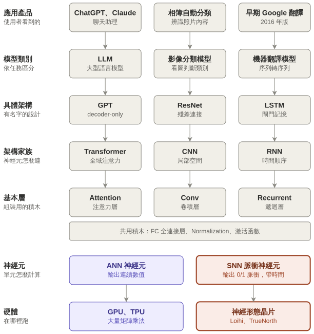

歡迎來到 SNN Academy！

## SNN (Spiking Neural Network) 是什麼 ?

在深度學習中它定位是底層的運算方式，它可以發展出自己的 `Convolution`，`Fully Connection`，有低功耗，可解釋性的優勢。

## 這個網站要幹嘛 ?

這個網站將以 **LIF (Leaky Integrate-and-Fire)** 神經元模型為起點

從生物學的源頭出發，一路到 SNN (Spiking Neural Network) 類神經網路的原理，並分享一些在軟體訓練 SNN 模型的方式，以及在硬體 (FPGA) 上運行的技巧。

以下是一顆知識樹，可以點擊綠色亮起的節點到對應的章節

<KnowledgeTree />
