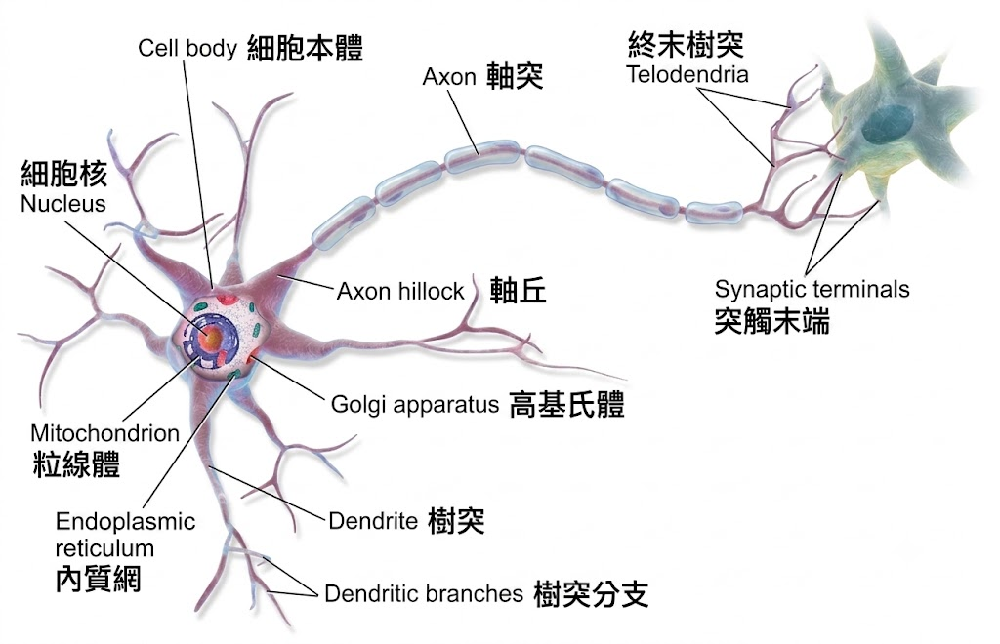
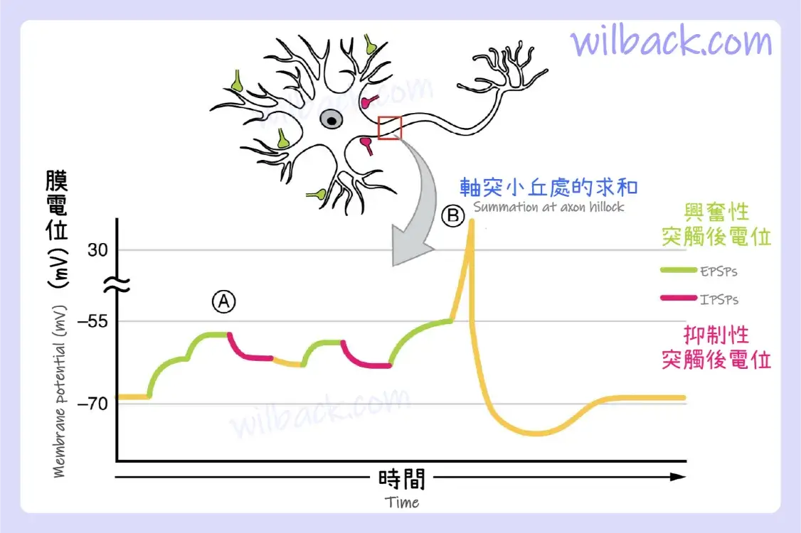
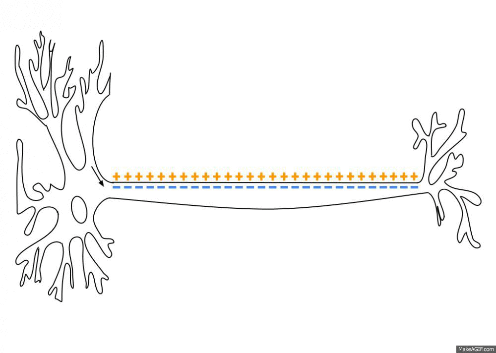
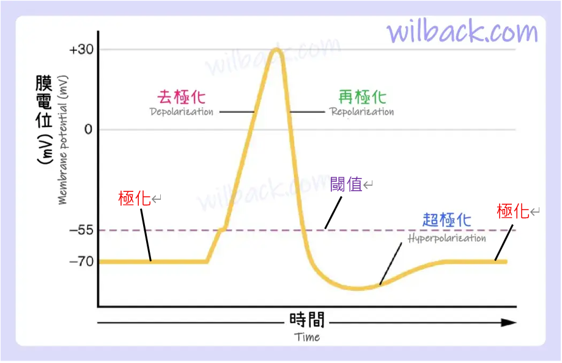
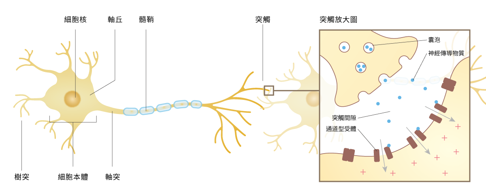

# LIF (Leaky Integrate-and-Fire) 開端 — 生物的視角

這裡會從生物神經元的角度慢慢帶出 LIF 模型的源頭

生物視角概念——完整說明見[生物：神經細胞](../../biological/neuron-cell.md)。

圖源: https://zh-yue.wikipedia.org/wiki/%E7%A5%9E%E7%B6%93%E5%85%83#/media/File:Blausen_0657_MultipolarNeuron.png

## 訊號怎麼被觸發與傳遞

1. 樹突接收前一級神經元的突觸訊號
2. 各方訊號在樹突與細胞本體(soma)的膜上不斷加總（空間 + 時間加總）累積電位
3. (興奮/抑制) 在 (時間/空間) 上加總後的電位在 **軸丘** 做過閾值判斷
     突觸會分出興奮突觸以及抑制突觸，去極化的條件就是加總訊號超越閾值
    
4. **軸丘**的電位 $>$ 閾值，會發出脈衝 spike 
     如下動畫
    
    圖源: https://zh-yue.wikipedia.org/wiki/%E5%8B%95%E4%BD%9C%E9%9B%BB%E4%BD%8D#/media/File:Action_Potential.gif

## Spiking 經歷的四個階段

進一步分析神經元 spike 的過程

::: details 1. 極化(靜止電位)：神經細胞在休息狀態下
* 細胞膜內帶負電、膜外環境帶正電
* 主因是`鉀離子外漏($K^+$ leak)`：靜止時膜對 $K^+$ 的通透性遠大於 $Na^+$，$K^+$ 順濃度往膜外漏出，使膜內偏負
* `鈉鉀幫浦`則負責長期維持濃度差: 1 個能量(ATP) 讓膜外得 $Na^+ \times3$ 膜內得 $K^+ \times 2$；因送出的正電比送進的多，也會小幅貢獻負電
:::

::: details  2. 去極化：膜電位上升的時候 **(重要)**
* 當神經細胞`樹突`上的`受體`，接收來自`突觸前細胞`的神經傳導因子，如：麩胺酸(glutamate)，對應到的`受體(化學訊號驅動)`會接收到因子並活化打開`蛋白質通道`，讓$Na^+，Ca^{2+}$等離子`進入細胞膜而提升膜電位(初步去極化)`。
* 當電位通過`軸突`前端的「`軸丘`」時，若電位高於鈉離子通道的`閾值(興奮閥值)`，則會開啟`電位依賴性鈉離子通道(電訊號驅動)`使大量的鈉離子($Na^+$)往細胞內流動，產生`去極化`的現象，讓膜電位變成帶正電(約$+40 mV$) （嚴格來說，起火點是軸丘後方的`軸突起始段(Axon Initial Segment, AIS)`，那裡的鈉離子通道密度最高；這裡為了簡化統稱`軸丘`）
* 一顆神經細胞接收`來自於成千上萬個不同型態的突觸`，有`興奮性(導致電位升高)`也有`抑制性(導致電位下降)`訊號，而`是否會產生動作電位`，端看最終膜電位是否達到`閾值`。
:::

::: details 3. 再極化：初步恢復極化
* 當膜電位達到高峰時，`鈉離子通道`會關閉(不應期，局部的$Na+$通道蛋白會關閉，否則會逆流)，同時開啟`鉀離子通道`，讓細胞內的鉀離子流出細胞，平衡膜內過多的正電荷，讓`膜電位`再回到帶負電的狀態，稱為「再極化」
* 不應期失效可能導致癲癇 https://pmc.ncbi.nlm.nih.gov/articles/PMC1180547/
:::

::: details 4. 過極化：再極化過度，導致比極化的電位還負
* 當`膜電位`回復到`靜止電位`時，`鉀離子通道`才準備關閉，鉀離子還在持續流出細胞時，造成電位低於`靜止電位`的「過極化」現象
* 此時`鈉鉀幫浦`也會出動，消耗能量(ATP)幫忙把 $Na^+ \times3$ 膜內得 $K^+ \times 2$，讓內外膜電位以及鈉鉀離子濃度`恢復成(極化)`。
:::

所以重點就在於電位累積以及 **去極化** 的邏輯

## 突觸輸入以及抽象化

進一步觀察訊號傳遞過程，神經傳遞物質就是控制蛋白質通道開啟的鑰匙

進一步拉大就像這樣，離子進出相當於有股電流 $I(t)$，走到這裡就是準備把它抽象化成電路了

下一步：[等效電路的概念](./circuit-concept.md) —— 把這裡的生理機制對應到等效電路元件。
