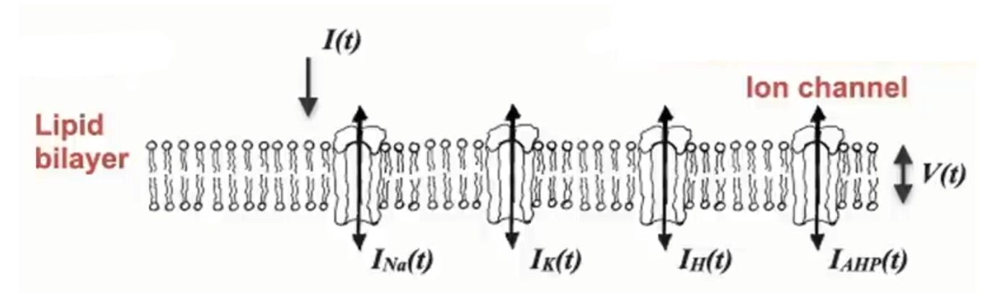
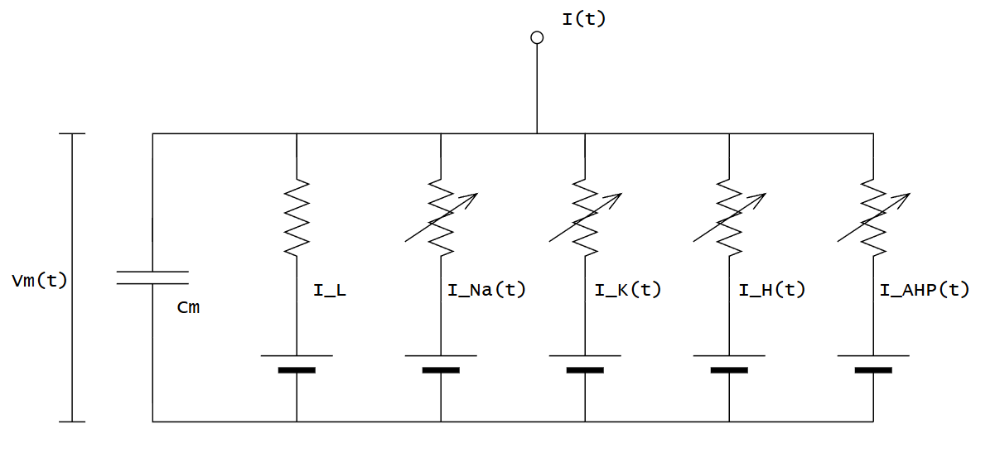

# LIF：等效電路的概念

這裡會從等效電路的角度慢慢帶出 LIF 模型的源頭

等效電路概念—完整說明見[電路：等效電路](../../circuit/equivalent-circuit.md)。

## 概念遷移: 生物 $\to$ 電路

* $V(t)$: 膜電位
* $I(t)$: 總輸入電流（外部灌進膜的電流，可能來自突觸或電極注入）
* $I_{Na}(t), I_{K}(t), I_{H}(t), I_{AHP}(t)$: 各種離子電流
    * $H$ 代表 **H**yperpolarization-activated，節律電流 (暫時不討論)
    * $AHP \to$ **A**fter**H**yper**P**olarization，過極化後電流 (暫時不討論)

* $C_{m}$: 膜電容 $m \to membrane$
    * 細胞膜的`脂雙層`是絕緣層，兩側是導電的離子溶液 → 天生就是一個電容
    * 關係式 $Q = C_m \cdot V_m$：要把膜電位 $V_m$ 拉高，得先在膜上累積電荷 $Q$
    * 這就是 LIF 裡「**Integrate（累積）**」的來源
* $I_{L}$: 漏電流 $L \to Leak$
    * 就算沒有突觸輸入，膜也不是完美絕緣體——有一直開著的通道（主要是 $K^+$ 外漏）讓離子持續滲漏
    * 電路上是與電容並聯的電阻路徑，會讓膜電位自己慢慢滑回`靜止電位(極化)`
    * 這就是 LIF 裡「**Leaky（會漏）**」的來源

## 電流恆等公式推導

$$I(t) = C_m \frac{dV_m(t)}{dt} + I_L(t) + I_{Na}(t) + I_K(t) + I_H(t) + I_{AHP}(t)$$

把電流進一步展開。
* 每個 $E_X$ 是該離子的「目標電壓」，電路上就是一顆**電池**（reversal potential）
* 漏電流的 $R_L$ 是固定電阻
* 其餘離子通道則是圖上畫的**可變電阻**，電阻值會隨電壓與時間變動，所以記成 $R_{Na}(t)$、$R_K(t)$…

$$I(t) = C_m \frac{dV_m(t)}{dt} + \frac{V_m(t) - E_L}{R_L} + \frac{V_m(t) - E_{Na}}{R_{Na}(t)} + \frac{V_m(t) - E_K}{R_K(t)} + \frac{V_m(t) - E_H}{R_H(t)} + \frac{V_m(t) - E_{AHP}}{R_{AHP}(t)}$$

$$\text{換成電導}: g = \dfrac{1}{R}$$

$$I(t) = C_m \frac{dV_m(t)}{dt} + g_L(V_m(t) - E_L) + g_{Na}(t)(V_m(t) - E_{Na}) + g_K(t)(V_m(t) - E_K) + g_H(t)(V_m(t) - E_H) + g_{AHP}(t)(V_m(t) - E_{AHP})$$

$$C_m \frac{dV_m(t)}{dt} = - g_L(V_m(t) - E_L) - g_{Na}(t)(V_m(t) - E_{Na}) - g_K(t)(V_m(t) - E_K) - g_H(t)(V_m(t) - E_H) - g_{AHP}(t)(V_m(t) - E_{AHP}) + I(t)$$

這條式子的**長相**就推導到這裡：一張電路圖 ＝ 一條電流恆等式。

至於這些**可變電阻**的數值多大、又怎麼隨電壓暴衝而打出 spike——那屬於「式子隨時間怎麼跑」的動態行為，連同怎麼把它砍成乾淨的 LIF，都留到下一頁的微分方程分析。

---

下一步：[微分方程](./differential-equation.md) —— 把這張電路圖轉換成精確的微分方程。
