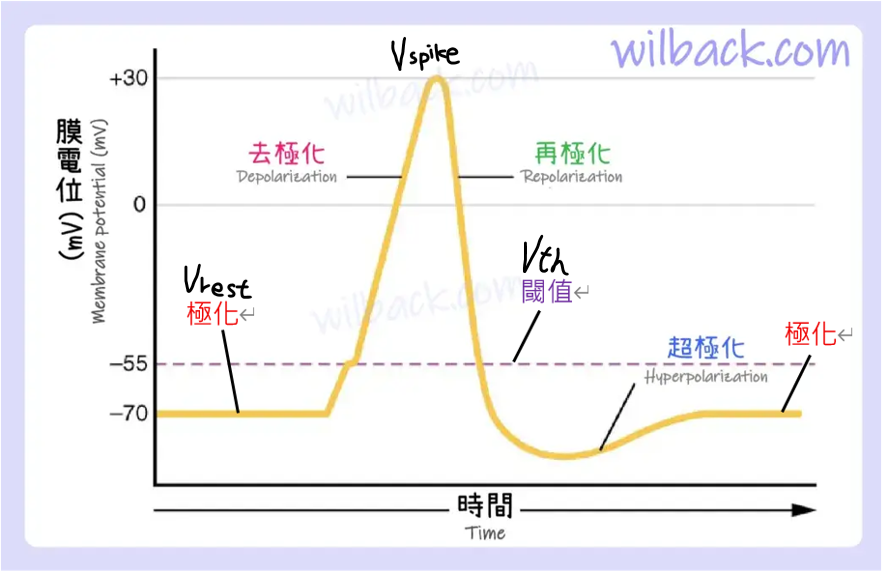

# LIF：微分方程

承接[等效電路的概念](./circuit-concept.md)推出的電流恆等式，這一頁要分析它「隨時間怎麼跑」，並把它砍成乾淨的 Leaky Integrate-and-Fire。

## 快速複習微分方程

這裡帶過微分方程的特性

* $\frac{dy(t)}{dt} = ay$ 且 $a > 0$
    * $y$ 的變化 $\frac{dy}{dt}$ $\propto$ $y$ 
    * $y$ 越大 $\to \frac{dy}{dt}$ 越大，$y$ 就增加得越快
    * 這是一個**正回饋**的系統，會指數爆炸
    * 只有 $y = 0$ 時 $\frac{dy}{dt} = 0$，但這個平衡點是**不穩定**的：稍微偏離一點就會被越推越遠，回不來
    * $a$ 代表「變化的速度」：$a$ 越大，$y$ 越快爆炸
* $\frac{dy(t)}{dt} = -ay$ 且 $a > 0$
    * $y$ 的變化 $\frac{dy}{dt}$ $\propto$ $-y$ 
    * $y$ 越大 $\to \frac{dy}{dt}$ 越負，$y$ 就掉得越快
    * 這是一個**負回饋**的系統，會指數衰減
    * 只有 $y = 0$ 時 $\frac{dy}{dt} = 0$，而且這個平衡點是**穩定**的：偏離了會被拉回來
    * $a$ 代表「變化的速度」：$a$ 越大，$y$ 越快衰減成 0

::: tip 下面這個是重點
把上面的穩定平衡點從 $0$ 平移到任意的 $b$，就是後面整條膜電位方程的基本零件。
:::

* $\frac{dy(t)}{dt} = -a(y - b)$ 且 $a > 0$ 
    * $y > b$ 時 $\frac{dy}{dt} < 0$，這表示 $y$ 會慢慢往下掉
    * $y < b$ 時 $\frac{dy}{dt} > 0$，這表示 $y$ 會慢慢往上升
    * 這說明 $y$ 會不斷被拉向 $b$
    * 只有 $y = b$ 時 $\frac{dy}{dt} = 0$，且是**穩定**平衡點
    * $a$ 代表「變化的速度」：$a$ 越大，$y$ 越快被拉向 $b$

## 膜電位微分方程

回到這條式子，他由很多 $-a(y - b)$ 組成

$$C_m \frac{dV_m(t)}{dt} = - g_L(V_m(t) - E_L) - g_{Na}(t)(V_m(t) - E_{Na}) - g_K(t)(V_m(t) - E_K) - g_H(t)(V_m(t) - E_H) - g_{AHP}(t)(V_m(t) - E_{AHP}) + I(t)$$

每項 $-g_X(t)(V_m - E_X)$ 都會把膜電位 $V_m$ 拉向該離子的目標電壓 $E_X$
  而 $g_X(t)$ 是「現在拉得多用力」（$g_X = 0$ 就是沒有力氣）。

::: info 關於單位
下面的電導都寫成「每單位膜面積」的 $mS/cm^2$，所以整條式子談的是**電流密度**：$C_m$ 的單位是 $\mu F/cm^2$、$I(t)$ 的單位是 $\mu A/cm^2$。
:::

---

先看幾個假設數值（近似值）：

| 符號 | 電壓 |
|---|---|
| 靜止電位 ($V_{rest}$) | $\approx -70\ mV$ |
| 閾值 ($V_{th}$) | $\approx -55\ mV$ |
| spike ($V_{spike}$) 峰值 | $\approx +30\ mV$ | 

---

| 項 | 目標電壓 $E_X$ | 電導 $g_X$ 的特性 | 最大電導 |
|---|---|---|---|
| $Leak$ | $E_L \approx -70\ mV$（≈ $V_{rest}$） | $g_L$ **固定不變**、很小 | $0.3\ mS/cm^2$ |
| $Na^+$ | $E_{Na} \approx +60\ mV$（很高） | $g_{Na}$ 隨電壓變化的正回饋，$V_m$ 越大 $g_{Na}$ 越大，直到 $V_m = V_{th}$ 明顯暴衝 | $120\ mS/cm^2$ |
| $K^+$ | $E_K \approx -80\ mV$（很低） | 靜止時 $\approx 0$，放電時才變大（比 $Na^+$ 慢一步） | $36\ mS/cm^2$ |
| $I_H$ | $E_H \approx -30\ mV$ | 反過來——$V_m$ **越負才越開**，且反應很慢 | 小（依模型而定） |
| $I_{AHP}$ | $E_{AHP} \approx E_K \approx -80\ mV$ | 每次 spike 後由流入的 $Ca^{2+}$ 觸發、很慢 | 小（依模型而定） |

* $I_H, I_{AHP}$ 本身對 spike 的產生沒有直接影響，主要是調整 spike 後的恢復期與頻率，因此待會的內容會忽略他們
* 注意 $g_{Na}$ 的特性，可以發現他是觸發 spiking (使電壓到達 $V_{spike}$)的關鍵因素

---

梳理一下 spike 的過程：

1. **累積階段**：$g_{Na}, g_K \approx 0$，只剩 $Leak$ 和 $I(t)$ 作用。
    * 假設 $I(t)$ 受到刺激變大了，$V_m$ 開始變大，$g_{Na}$ 也開始上升
2. **一過** $V_{th}$
    * $g_{Na}$ 暴衝成幾百倍 $\to -g_{Na}(V_m - E_{Na})$ 變得很有影響力
    * 用極大的力把 $V_m$ 往 $E_{Na}(+60 mV)$ 猛拉 $\to$ 衝出 spike 的上升段。
3. **隨後**：$g_K$ 變大、$g_{Na}$ 自己關閉（去活化）$\to$ 把 $V_m$ 往 $-80\ mV$ 拽回 → spike 的下降段與過極化。

也就是說，生物篇的**去極化 / 再極化 / 過極化**那整套動作電位，**寫在這條式子裡**，是 $g_{Na}$、$g_K$ 隨電壓自動開關演出來的。

## 化成 LIF(Leaky Integrate-and-Fire)

前面那條公式又臭又長，在數學分析 或 程式模擬都是過於複雜
 但看懂行為後，觀察到兩件事：

1. 閾值（$V_{th}$）以下的累積階段，其實只剩 $Leak$ 和輸入 $I(t)$
2. 那些電壓門控項（$Na/K/H/AHP$）負責處理 spiking 與重置。

於是 LIF 的取捨就是： 把離子通道全丟掉、只留 $Leak$ 與 $I(t)$，再用一個條件判斷（過閾值就 spiking & 重置）頂替被丟掉的放電機制。

---

### 保留漏電積分 Leaky Integrate

$$C_m \frac{dV_m(t)}{dt} = -g_L(V_m(t) - E_L) + I(t)$$
$$\tau_m = R_L C_m = \frac{C_m}{g_L}$$
$$\frac{dV_m(t)}{dt} = -\frac{1}{\tau_m}(V_m(t) - E_L) + \frac{I(t)}{C_m}$$

注意: 並不是把複雜的邏輯全部壓縮進 $I(t)$。
 $I(t)$ 就只是一個外部刺激電流，**裡面沒有藏一個會被自己觸發、然後暴衝的 $g_{Na}(t)$**。
 所以光靠這條式子，$V_m$ 只會被 $I(t)$ 推著慢慢爬，永遠不會自己打出 spike，也不會自己重置。得另外用人工的方式補回來。

### 補上人工機制 Fire(Spike) & Reset

這裡額外假設幾個符號
* $t_k$: 表示第 $k$ 次 spike 發生的時間
* $\tau_{ref}$: 表示 spike 後的不應期長度（這段期間膜電位被強制固定住）
* $V_{reset}$: spike 後被壓回去的電位，這裡就取 $V_{reset} = V_{rest} \approx -70\ mV$

整個流程是:
* 在 $t_k$ 的時候 $V_m(t_k) \ge V_{th}$ 導致 spiking
    * 這裡 spiking 的概念並不是說把 $V_m = V_{spike}$，而是把它當作一個 `事件(有/沒有)`，$V_m \ge V_{th}$ 的瞬間就會被重置
* spiking 後一段時間內都卡在 $V_{reset}$
   $V_m(t) = V_{reset}，\{t_k^+ < t < t_k^+ + \tau_{ref}\}$
* 過了 $t_k + \tau_{ref}$ 之後解除固定，微分方程從 $V_{reset}$ 重新開始積分，等著下一次過閾值

## 總結與視覺化

把 LIF 的公式整理再一起:

$$\frac{dV_m(t)}{dt} = -\frac{1}{\tau_m}(V_m(t) - E_L) + \frac{I(t)}{C_m}$$
$$V_m(t_k) \ge V_{th} \to \text{spiking}$$
$$V_m(t) = V_{reset}，\{t_k^+ < t < t_k^+ + \tau_{ref}\}$$

