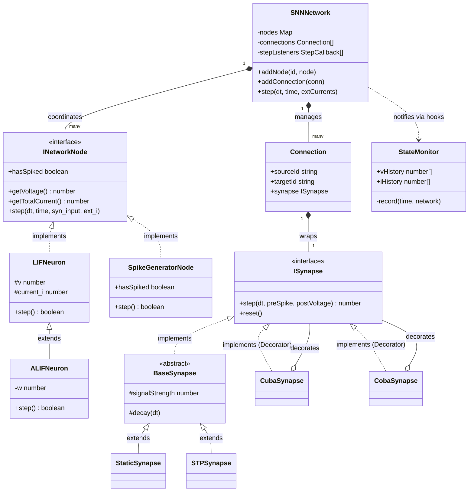

# SNN Sandbox 系統架構圖 (System Structure)

本文件詳述了 SNN 視覺化沙盒的軟體架構、模組職責以及資料流向。

---

## 1. 模組職責說明 (Module Responsibilities)

系統採用高度解耦的層級式架構，分為以下四大層：

### I. UI & Orchestration Layer (使用者介面與協調層)
*   **`App.vue`**: 應用程式入口，掛載主沙盒組件。
*   **`BasicLIFSandbox.vue`**: 系統的中樞。負責維護 Vue 的響應式狀態 (params, history)、管理 `SNNNetwork` 的生命週期，並將數據傳遞給 SVG 繪圖函數。

### II. Network & Monitoring Layer (網路管理與監控層)
*   **`SNNNetwork.ts`**: 全局協調者。儲存節點與連線拓撲，執行核心路由邏輯，並透過 Hook 機制廣播模擬事件。
*   **`Connection.ts`**: 定義點對點的突觸連結關係。
*   **`INetworkNode.ts`**: 網路節點的通訊協議，確保異質節點（如神經元與產生器）能互通。
*   **`StateMonitor.ts`**: 專業監聽器。掛載於網路事件上，自動從節點內部「拉取 (Pull)」電壓與電流數據，實現模擬與紀錄的分離。

### III. Neuron & Source Layer (神經元與訊號源層)
*   **`LIFNeuron.ts`**: 基礎積分器。實作 $dV/dt$ 物理方程，不關心輸入來源的性質。
*   **`ALIFNeuron.ts`**: 具備適應性電流 $w(t)$ 的擴展神經元。
*   **`SpikeGeneratorNode.ts`**: 輕量級脈衝產生器，內部封裝 `PoissonSource`。
*   **`PoissonSource.ts` / `GWNSource.ts`**: 最底層的隨機數產生器，負責擲骰子產出原始脈衝與高斯噪聲。

### IV. Synapse Decorator Layer (突觸動態與裝飾器層)
*   **`ISynapse.ts`**: 突觸的標準介面。
*   **`BaseSynapse.ts`**: 提供指數衰減的共通邏輯。
*   **`StaticSynapse.ts` / `STPSynapse.ts`**: 處理「時間動態」：訊號強度 $S(t)$ 如何隨脈衝歷史演化。
*   **`CubaSynapse.ts` / `CobaSynapse.ts`**: 處理「物理映射」：使用裝飾器模式將抽象訊號 $S(t)$ 轉換為物理電流 $I_{syn}$。

---

## 2. Mermaid 類別關聯圖 (Class Diagram)

---

## 3. 模擬資料流向圖 (Simulation Sequence Diagram)

此序列圖描述了單一時間步長 ($dt$) 內，資料如何在模組間流動與轉換。

```mermaid
sequenceDiagram
    autonumber
    participant UI as Vue UI (Sandbox)
    participant Net as SNNNetwork
    participant NodeA as Source Node
    participant Syn as Synapse Decorator
    participant NodeB as Target Node
    participant Mon as StateMonitor

    UI->>Net: step(dt, time)
    
    rect rgb(30, 30, 40)
    Note over Net, NodeB: 1. 路由階段 (Routing)
    Net->>NodeA: 上一步發火了沒? (hasSpiked)
    NodeA-->>Net: 是 / 否
    Net->>Syn: 執行物理轉換 step(fired, targetVoltage)
    Syn-->>Net: 回傳物理電流 (I_syn)
    Net->>Net: 將 I_syn 存入 Target 緩衝區
    end

    rect rgb(40, 40, 30)
    Note over Net, NodeB: 2. 積分階段 (Integration)
    Net->>NodeB: 命令更新 step(buffer_current + ext_i)
    NodeB->>NodeB: 求解電壓微分方程
    end

    rect rgb(30, 40, 30)
    Note over Net, Mon: 3. 監聽階段 (Monitoring)
    Net->>Mon: 廣播 postStep 事件
    Mon->>NodeB: 讀取電壓 getVoltage()
    Mon->>NodeB: 讀取電流 getTotalCurrent()
    Mon->>Mon: 存入歷史記錄陣列
    end

    Mon-->>UI: 數據響應式綁定渲染
```

